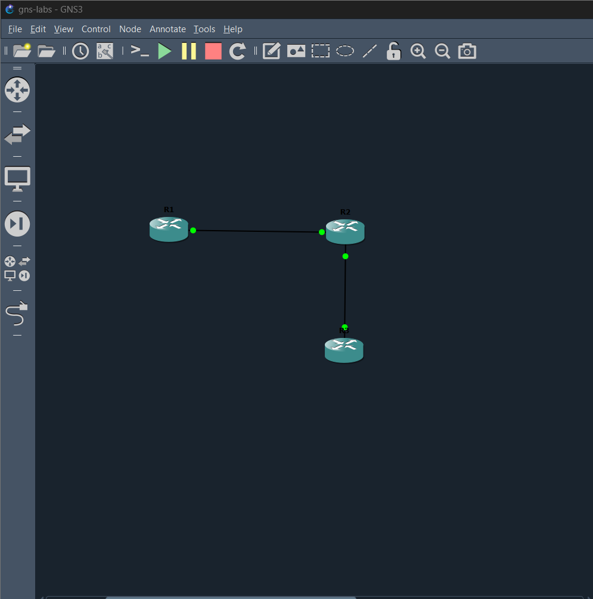
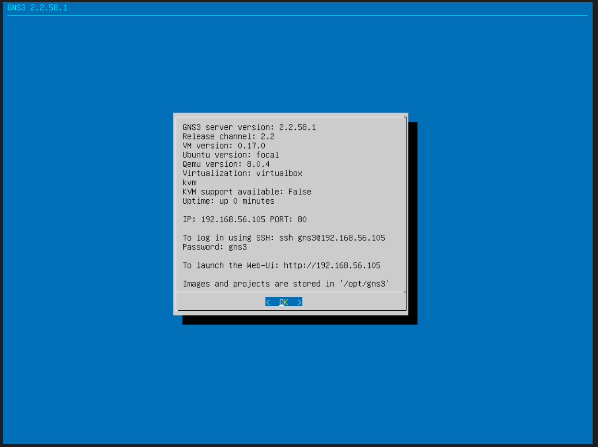
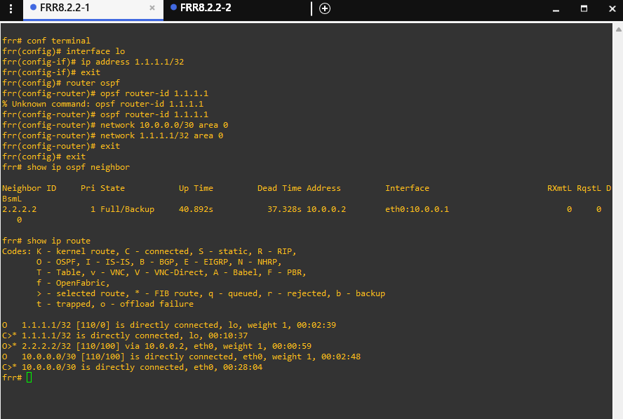
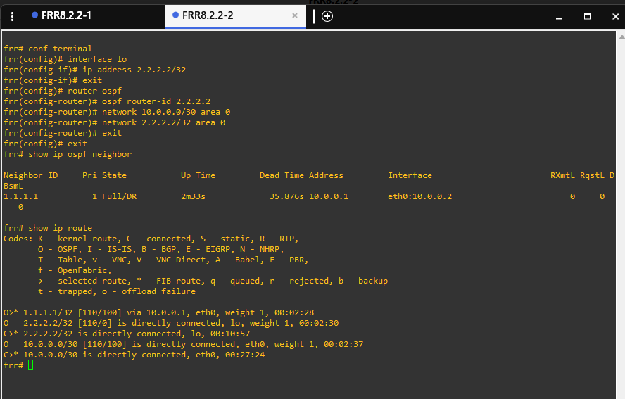
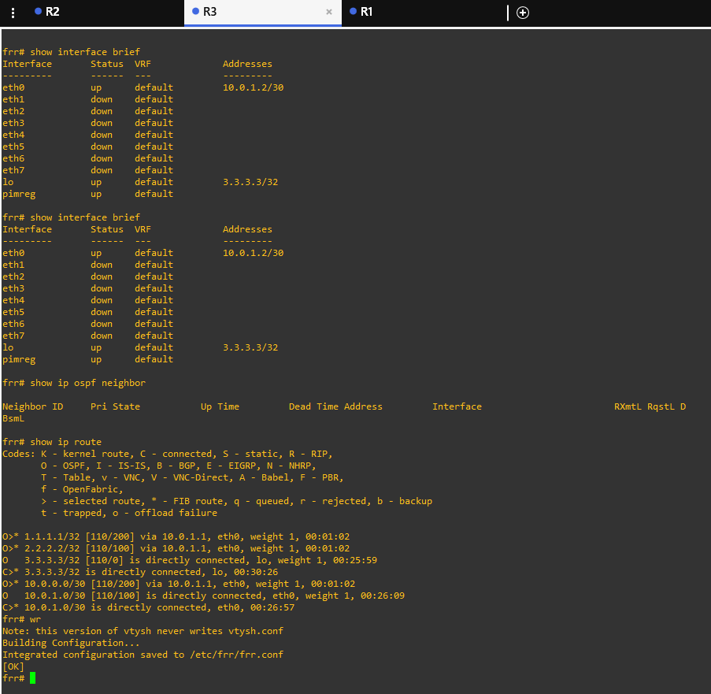
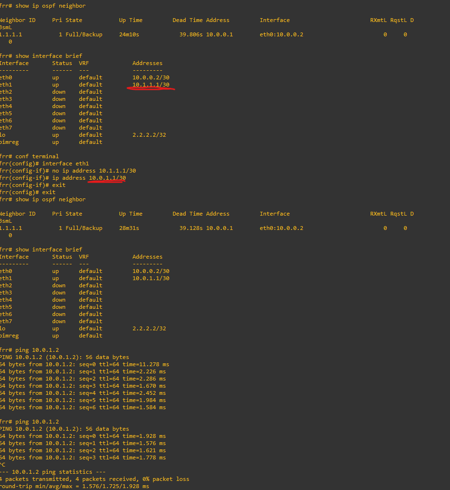
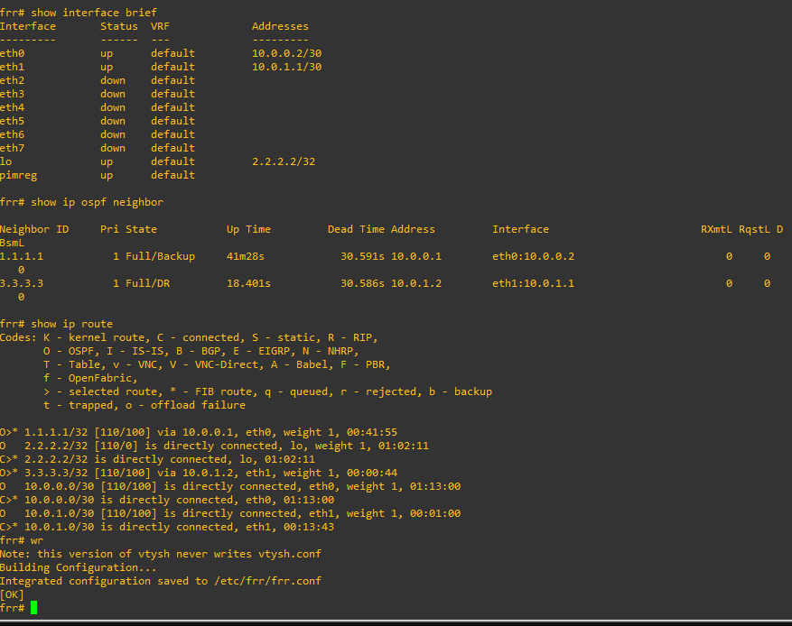

# Week 2 — Routing Protocols + GNS3 Lab
### May 11–15, 2026

## What I Learned This Week
This week I went from understanding routing in theory to actually 
building a working multi-router network with my own hands. Spoiler: 
it broke. Multiple times. And that ended up being the best part.

## The Concepts
There are 3 ways a router learns about networks:
- **Directly connected** - physically plugged in, no setup needed
- **Static routes** - a human manually types them
- **Dynamic routing protocols** - routers talk to each other and 
  share what they know automatically

Two main dynamic protocols I learned about:
- **OSPF** - used INSIDE a company. Routers share a complete map 
  of the network with each other and calculate the shortest path 
  to every destination.
- **BGP** - used BETWEEN companies. This is literally what holds 
  the internet together. Every ISP, every cloud provider speaks 
  BGP. It's policy-driven, not distance-driven, meaning it picks 
  paths based on business rules and contracts, not just shortest 
  distance.

Key thing that stuck with me: OSPF is called an IGP (Interior 
Gateway Protocol), BGP is called an EGP (Exterior Gateway Protocol). 
Interior = inside your network. Exterior = between networks.

## The Lab — Building 3 Routers with OSPF
Spent way longer than expected getting GNS3 set up. Learned a 
ton about VMs, NAT vs Host-Only adapters, DHCP servers, and why 
binding to localhost vs a network IP matters. None of that was 
in the original plan but I'm honestly glad it happened.

Once GNS3 was running I built this topology:

 

Each router got a loopback interface as its identifier. I 
configured OSPF on all 3 routers and told them which networks 
to advertise. Then I just watched routes propagate.

  

## The Moment It Clicked
The coolest part was when R1's routing table showed a route to 
3.3.3.3, even though R1 has no direct connection to R3. R2 
told R1 about it via OSPF. I never typed that route. The network 
just figured it out.

Then I pinged 3.3.3.3 from R1 and it worked. R1 sent the packet 
to R2. R2 forwarded it to R3. R3 replied back through the same 
path. None of that was manually configured, OSPF handled it 
all dynamically.

## Breaking Things on Purpose
The best learning came from intentionally breaking the lab:
- Shut down R2's loopback -> R1's route to it disappeared within 
  seconds
- Brought it back up -> route came back automatically
- Shut down R1's interface to R2 entirely -> R1 lost ALL its 
  OSPF neighbors, everything except its own loopback
- Brought it back -> full convergence happened in under a minute

## Mistakes I Made — And They Were Stupid Simple
This is where it got real.

When I added R3 to the topology I had to configure a new 
interface on R2 to connect to it. I typed the wrong IP. Instead 
of `10.0.1.1` I typed `10.1.1.1`. One digit off.

R3 couldn't see R2. R2 couldn't see R3. OSPF wouldn't form a 
neighborship. I spent a good amount of time staring at the 
configs wondering what was wrong.

Then it hit me... they're not even on the same subnet. R2 was 
on 10.1.1.0/30. R3 was on 10.0.1.0/30. Totally different networks. 
Of course they couldn't talk.

Fixed the IP. Pinged. It worked. Checked OSPF neighbors. R3 
still didn't show up. Turned out OSPF had been told to listen 
for the 10.0.1.0/30 network... but when I ran that command 
earlier, R2's interface had the WRONG IP. So OSPF skipped the 
interface and never came back to it. I had to re-run the 
network command after fixing the IP for OSPF to actually 
activate on that interface.

## Lessons Learned the Hard Way
- A single typo in an IP address can break a multi-router network
- Always verify Layer 3 connectivity with ping BEFORE blaming the 
  routing protocol
- Routing protocols depend on the IPs being correct first. If 
  the layers below are broken, the layers above won't work no 
  matter what you configure
- Troubleshooting should always be bottom-up: physical -> IP -> 
  routing
- "The network is broken" problems are sometimes something dumb 
  like a typo, a wrong subnet, or a forgotten command.

## Commands That Got Burned Into My Memory
- `show ip route` - see the routing table
- `show ip ospf neighbor` - see OSPF neighbor relationships  
- `show ip ospf interface eth1` - see if OSPF is actually 
  running on that interface
- `show interface brief` - quick view of all interfaces and 
  their IPs
- `ping <ip>` - the simplest and most important troubleshooting 
  tool
- `write memory` - save router config so it survives a reboot

## What Surprised Me
How forgiving the protocol is. I broke things badly multiple 
times and OSPF just... figured it out and recovered. As long as 
the configuration was correct, the protocol did the rest.

## Status
Week 2 Complete — TCP/IP Deep Dive is next!
